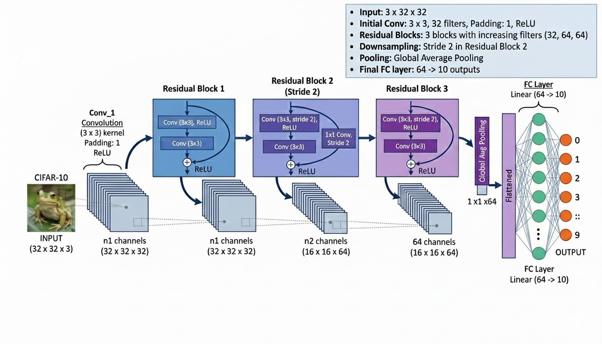
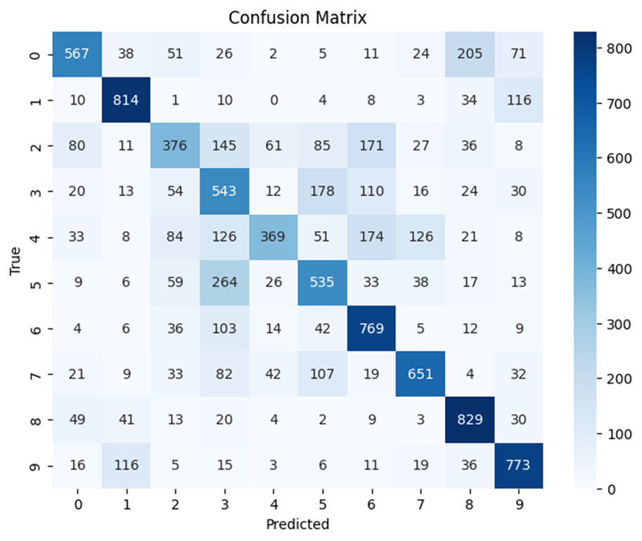
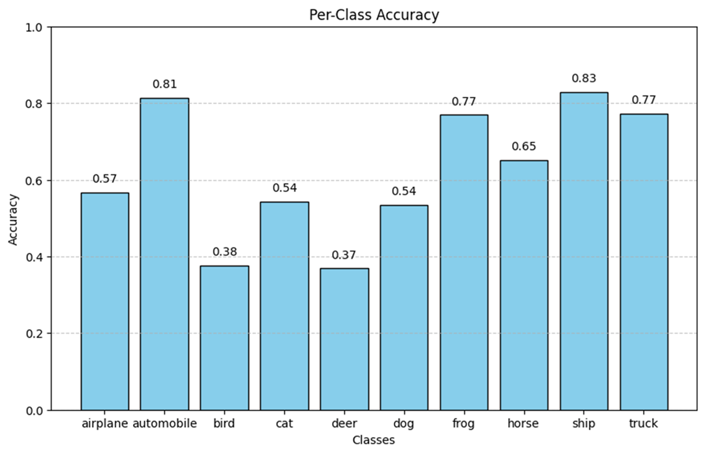

# Residual-Networks-CNN-For-Identifying-Elements-in-Images
This is my semester project for Artificial Intelligence course in Information Technology University, Lahore, Pakistan.

Optimizing CIFAR-10 Classification: Residual Networks, Data Augmentation, and Regularization Techniques

Goal & motivation behind the project:
Goal: To build a robust CNN model for CIFAR-10 image classification by exploring the Regularization and Data Augmentation paths.
Motivation: Solve the "Vanishing Gradient" problem using Residual Connections. Compare how smart Weight Decay (Regularization) vs. synthetic data variety (Augmentation) impacts performance in a fixed training window.

CIFAR-10 dataset summary:
60,000 color images (32×32 pixels)
10 classes: airplane, car, bird, cat, deer, dog, frog, horse, ship, truck
50,000 training + 10,000 testing images

Architecture Diagram:

Our model results (After 5 epochs):
Confison matrix:

Per-class accuracy:

